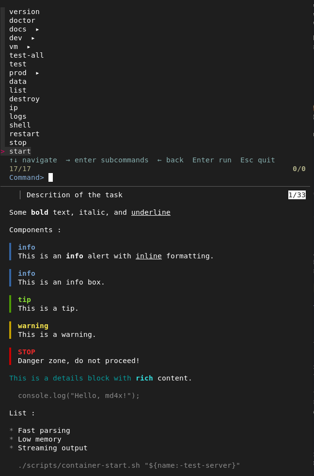

# 🎯 maski

Interactive TUI for [mask](https://github.com/jacobdeichert/mask) — browse and run maskfile commands with fuzzy search.



## Features

- **Fuzzy search** — quickly find commands by typing
- **Hierarchical navigation** — browse subcommands with arrow keys (`→` enter, `←` back, `Esc` quit)
- **Rich preview** — see full markdown documentation with ANSI rendering powered by [md4x](https://github.com/unjs/md4x)
- **Comark/MDC support** — renders block components, alerts, and inline components
- **Interactive prompts** — fill in arguments and flags before execution
- **Zero config** — just run `maski` in a directory with a `maskfile.md`

## Install

```bash
cargo install maski
```

Requires [mask](https://github.com/jacobdeichert/mask) to be installed (`mask --introspect` is used to read the maskfile structure).

## Usage

```bash
maski                          # launch TUI in current directory
maski --maskfile ./ops.md      # use a specific maskfile
maski --preview right          # preview panel on the right (default: down)
```

### Navigation

| Key | Action |
|-----|--------|
| `↑` `↓` | Navigate commands |
| `→` `Enter` | Enter subcommands / execute command |
| `←` | Go back to parent |
| `Esc` | Go back, or quit at root |
| Type | Fuzzy filter commands |

### Preview

The preview panel shows the full markdown content of each command section, rendered with syntax highlighting and formatting:

- **Bold**, *italic*, `inline code`
- Fenced code blocks with language detection
- MDC/Comark components (alerts, tips, warnings, details)
- Lists, blockquotes

## How it works

```
maski                          mask --introspect
  │                                  │
  │  1. get command tree ────────▶   │
  │                                  │
  │  2. receive JSON ◀──────────── { commands: [...] }
  │
  │  3. read maskfile.md for full markdown sections
  │
  │  4. TUI: skim fuzzy search + md4x ANSI preview
  │
  │  5. dialoguer prompts for args/flags
  │
  │  6. execute ─────────────────▶  mask <cmd> --flag val arg1
```

`maski` uses `mask --introspect` to get the command structure (names, args, flags, scripts) and reads the `maskfile.md` directly to extract the full markdown content for the preview panel.

The markdown is rendered to ANSI using [md4x](https://github.com/unjs/md4x) compiled as a C library (via FFI), so there are no external runtime dependencies.

## Background

This project started as [PR #145](https://github.com/jacobdeichert/mask/pull/145) to add an interactive mode directly to mask. The maintainer preferred to keep mask minimal, suggesting an external wrapper instead. `maski` is that wrapper — it uses mask's `--introspect` flag and subprocess execution, with zero coupling to mask's internals.

## License

MIT
